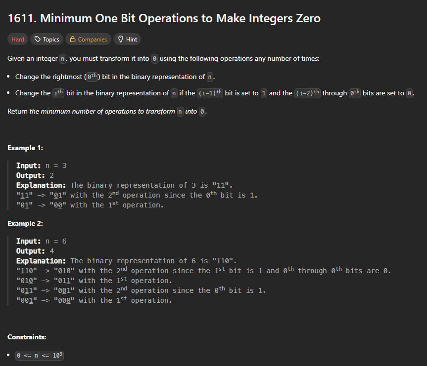
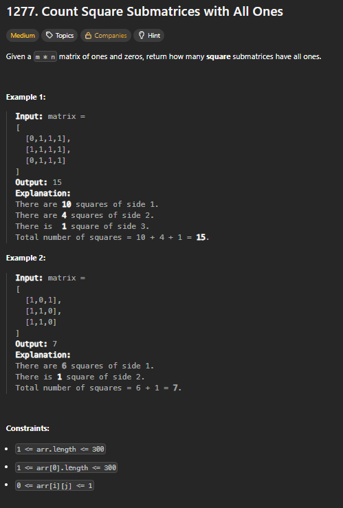

# Exercícios sobre Programação Dinâmica

**Conteúdo da Disciplina**: Programação Dinâmica 

## Alunos

|Matrícula | Aluno |
| -- | -- |
| 20/2023663 | Gabriel Basto Bertolazi |
| 20/2017503 | Wildemberg Sales da Silva Junior |

## Sobre

Esse exercício visa buscar a resolução dos exercícios escolhidos pela plataforma do LeetCode, com o objetivo de mostrar nossos conhecimentos aprendidos no conteúdo de Programação Dinâmica. Neles vamos aplicar conceitos e conhecimentos de lógica aprendidos na matéria de Projeto de Algoritmos com o professor Maurício Serrano.

## Screenshots

### Questão 1   

#### Questão 1 no LeetCode  

**Explicação da Resolução:** O código resolve o problema de transformar um número N em 0 usando o mínimo de opreações de bit, usando matemática como solução. Primeiramente é definido um custo fixo para resolver o bit mais significativo, e depois, é utilizado recursividade para resolver o restante do número que sobrou.

---

### Questão 2   

#### Questão 2 no LeetCode  

**Explicação da Resolução:** o loop principal, que modifica a própria matriz: se uma célula matrix for 1, seu novo valor é definido como $1$ mais o mínimo dos valores em seus três vizinhos imediatos (superior, esquerdo e diagonal superior-esquerdo). Este novo valor matrix passa a representar o tamanho lateral do maior quadrado de 1s que termina naquela posição. O segundo loop soma todos os valores da matriz modificada (a tabela DP), pois a soma de todos os tamanhos laterais é igual ao número total de submatrizes quadradas de 1s.

---

### Questão 3   

#### Questão 3 no LeetCode  

**Explicação da Resolução:** 

---

## Instalação

sudo apt update && sudo apt install -y build-essential

## Uso

gcc questao_x.c -o questao_x && ./questao_x

## Apresentação

Vídeo disponível em: [youtube](#)

## Outros

Para dúvidas, sugestões ou melhorias, entre em contato com os autores.
